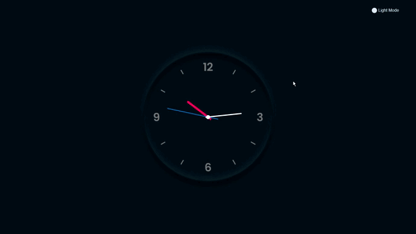

<h2 align="center">⌚⏲ANALOG CLOCK⏲⌚</h2>
<h1 align="center">

</h1>


<h2 align="center"> 📎 Acesse o projeto online em: 
<a href="https://gustabriel.github.io/analog-clock/">https://gustabriel.github.io/analog-clock/</a> </h2>


## 📝 Sobre:
#### Projeto simples consiste em um relógio analógico, feito com base em algumas aulas de css neumorphism e javaScript Date( ).
<br />

## 💾 Tecnologias utilizadas:
#### O Projeto foi desenvolvido utilizando as seguintes tecnologias:

##### - CSS;
##### - HTML;
##### - JavaScript;
<br />

## 📥 Como baixar o projeto:

``` bash
# 1 - Criar um pasta nova:
# 2 - Abrir o gitBash dentro dessa pasta:

# Clonar o repositório:
$ git clone https://github.com/Gustabriel/analog-clock.git

# Entrar no diretório:
$ cd analog-clock
```
<br />


<h5 align="center"> 📌 Desenvolvido por: <a href="https://www.linkedin.com/in/gabriel-gustavo31/">Gabriel Gustavo</a>;
</h5>
<h1 align="center"></h1>

<h6 align="center"> ✅ "Projeto finalizado" ✅  </h6>


